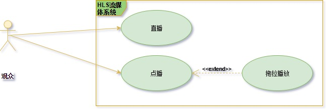
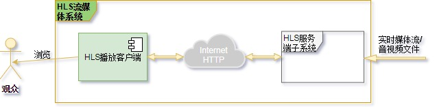
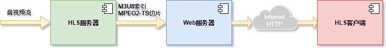
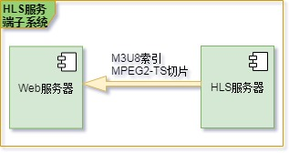
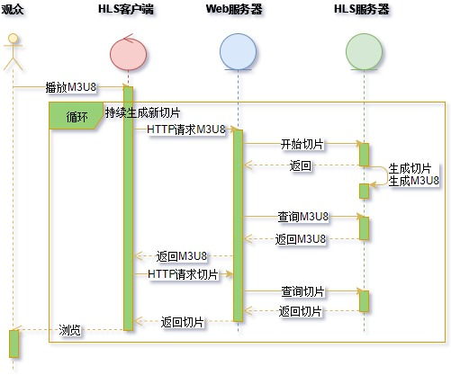
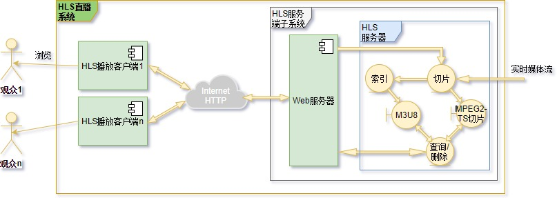
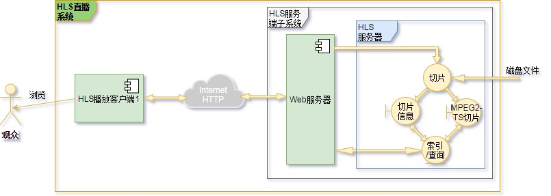

# HLS流媒体技术应用场景分析

## 概述

近几年来，随着移动互联网的普遍应用以及网络音视频直播、点播业务的不断增长，流媒体技术迅速成为业界研究与发展的热点。HLS（HTTP Live Streaming）流媒体技术，利用互联网Web基础设施，基于HTTP协议分发音视频内容，内生于苹果公司的iOS系统、MacOS系统，也容易部署到各种内容分发系统中，因而得到了广泛地应用。

本文详细分析了基于HLS流媒体技术的系统开发需求和主要应用场景，以作为后续系统详细设计与软件开发的参考与依据。

---

## HLS流媒体系统需求分析

HLS流媒体系统应当能够支持音视频直播、点播两种服务，并且在点播基础之上实现拖拉播放的基本功能，如下图所示。
> 

直播，是指将实时生成的媒体流经流媒体系统传输到播放客户端供观众浏览。点播，是指提取音视频文件作为流媒体系统的输入传输到客户端供观众浏览。在点播时，观众通常会拖拉播放客户端跳跃式地浏览音视频。

基于上述服务，HLS流媒体系统通常具有下图所示模型。
> 

下面简单描述HLS流媒体技术的细节，详细的规格由[RFC8216][]定义。

---

## HLS技术概述

HLS（HTTP Live Streaming）是利用HTTP协议传输音视频内容到客户端播放的流媒体技术。通常，HLS流媒体系统的构成组件主要包括HLS服务器、Web服务器以及HLS播放客户端，如下图所示。
> 

参考上节分析可知，Web服务器和HLS服务器共同构成了HLS服务端子系统，如下图所示。
> 

在此系统实现中，各组件功能如下：
- HLS服务器
  > 持续地将输入的音视频媒体流切割成时长有限的MPEG2-TS码流切片，并为切片生成M3U8索引。

- Web服务器
  > 通过HTTP协议持续地向HLS播放客户端分发M3U8索引和MPEG2-TS码流切片。

- HLS播放客户端
  > 持续地向Web服务器请求、接收并解析HTTP承载的M3U8索引；
  >
  > 持续地根据M3U8索引向Web服务器请求、接收并播放HTTP承载的MPEG2-TS码流切片。

系统基本工作流程如下图所示。
> 

下面详细分析直播、点播和拖拉播放的系统实现细节。

---

## HLS流媒体应用场景描述

直播与点播的主要不同在于：直播的媒体内容是实时生成的，观众不能回放过去的媒体内容，并且通常有很多观众同时收看同一个直播内容；点播的媒体内容通常是保存在磁盘上的录制媒体文件，并且通常点播是一对一服务的，因此收看点播内容时观众应能拖拉快进或者回放。

### 直播

一个典型的HLS直播系统应实现下图所示系统结构。
> 

在该系统实现中，切片模块持续地将输入的实时媒体流以GOP为基本单位分割成MPEG2-TS格式封装的媒体片段，索引模块按照[RFC8216]的规格标准持续地收集媒体片段的信息生成M3U8索引。切片模块是由Web服务器收到的客户端播放请求驱动开启工作的，查询/删除模块响应客户端的M3U8索引请求以及媒体切片请求，并及时删除已经过时的切片。

### 点播

一个典型的HLS点播系统与直播系统具有相似的系统结构。与直播系统的区别在于，点播的内容通常是存储在磁盘上的媒体文件。因此切片模块在启动之后可以一次性完成媒体文件的分割，索引模块不需要持续地生成M3U8索引，而只需在收到播放客户端的请求时实时生成即可。系统结构如下图所示。
> 

### 拖拉播放

在点播时，观众通常有拖拉播放录制媒体文件的需要。因此拖拉播放是点播系统的扩展功能，系统结构与点播系统是相同的。拖拉播放时，HLS服务器需要根据拖拉客户端播放进度条产生的时间信息，重新生成新的M3U8索引并返回给客户端。

[RFC8216]: http://www.rfc-editor.org/info/rfc8216