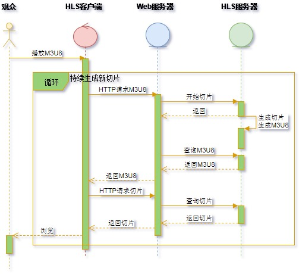

HLS流媒体技术应用场景分析
=====================

概述
---------------------
近几年来，随着移动互联网的普遍应用以及网络音视频直播、点播业务的不断增长，流媒体技术迅速成为业界研究与发展的热点。HLS流媒体技术，利用互联网Web基础设施，基于HTTP协议分发音视频内容，内生于苹果公司的iOS系统、MacOS系统，也容易部署到各种内容分发系统中。

本文详细分析了基于HLS流媒体技术的系统开发需求和主要应用场景，以作为后续系统详细设计与软件开发的参考与依据。

基于HLS流媒体技术的系统需求分析
---------------------
HLS流媒体系统主要支持直播、点播两种服务，而拖拉播放是在点播基础之上实现的基本功能，如下图所示。
> 

直播，是指将实时生成的媒体流经流媒体系统传输到播放客户端供观众浏览。点播，是指提取音视频录像文件作为流媒体系统的输入传输到客户端供观众浏览。在点播时，观众通常会拖拉播放客户端跳跃式地浏览音视频。

基于上述服务，HLS流媒体系统通常具有下图所示模型。
> 

HLS技术概述
---------------------
HLS（HTTP Live Streaming）是利用HTTP协议传输音视频内容到客户端播放的流媒体技术。HLS流媒体系统的基本构成组件如下图所示，主要包括HLS服务器、Web服务器以及HLS播放客户端。
> 

- HLS服务器
  > 持续地将输入的音视频流切割成时长有限的MPEG2-TS码流切片，并为切片生成M3U8索引。
- Web服务器
  > 通过HTTP协议持续地向HLS播放客户端分发M3U8索引和MPEG2-TS码流切片。
- HLS播放客户端
  > 持续地向Web服务器请求、接收并解析HTTP协议承载的M3U8索引；
  >
  > 持续地根据M3U8索引向Web服务器请求、接收并播放HTTP协议承载的MPEG2-TS码流切片。

HLS流媒体系统的基本工作流程如图2所示。
> 

HLS流媒体应用场景描述
---------------------